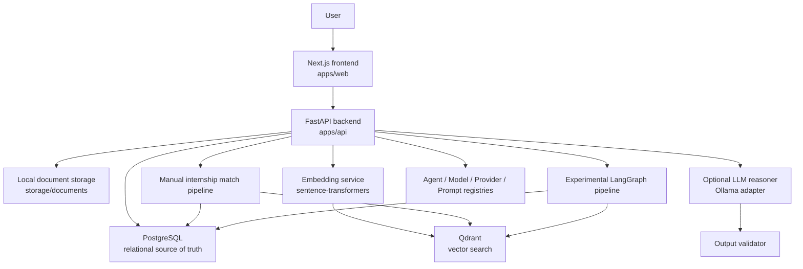

# AgentForge Architecture

AgentForge is a portfolio-grade AI internship workflow platform. It combines a
standard full-stack SaaS foundation with a retrieval and agent orchestration
layer for CV-to-internship matching.

The project is intentionally built in phases:

1. Core product foundation: frontend, backend, database, CRUD, and uploads.
2. Document intelligence: parsing, chunking, embeddings, and vector search.
3. Deterministic agent workflow: planner, retriever, evidence filtering,
   context building, and match reporting.
4. Optional LLM layer: prompt registry, model/provider registries, LLM
   reasoner, and output validator.
5. Experimental graph orchestration through LangGraph.

## System Overview



## Frontend

The frontend is a Next.js application in `apps/web`.

Current screens include:

- dashboard
- document upload and document table
- internship match workflow
- workspace-wide internship ranking

The frontend uses:

- TypeScript
- TanStack Query for API state
- a small shadcn-style component layer
- a typed API wrapper in `apps/web/lib/api.ts`

The internship match page supports two execution modes:

- Manual Pipeline
- LangGraph Pipeline

Both modes display the result in the same UI so the orchestration strategy can
change without changing the user experience.

## Backend

The backend is a FastAPI application in `apps/api`.

Important layers:

- routers expose HTTP endpoints
- services hold business logic
- Pydantic schemas define request and response contracts
- SQLAlchemy models define database tables
- Alembic manages migrations

The backend provides:

- health checks
- workspace, user, internship, and application CRUD foundation
- document upload, parsing, chunking, and indexing
- retrieval-only RAG search
- deterministic agent contracts
- optional LLM reasoning contracts
- agent run logging

## Data Stores

PostgreSQL is the source of truth for structured data:

- users
- workspaces
- workspace members
- documents
- document chunks
- internship posts
- applications
- agent runs
- agent steps
- agent logs

Qdrant stores vector representations of document chunks. PostgreSQL keeps the
chunk text and `qdrant_point_id`, while Qdrant stores the embedding vector plus
retrieval payload metadata.

Redis is included in local infrastructure for future background jobs and caching,
but the current core workflow is synchronous.

## Document Intelligence Pipeline

Uploaded CVs move through this flow:

```text
Upload
  -> local storage
  -> text extraction
  -> recursive text chunking
  -> PostgreSQL document_chunks
  -> embedding generation
  -> Qdrant indexing
```

Supported file types:

- PDF through `pypdf`
- DOCX through `python-docx`
- TXT through normal file reading

Chunking uses LangChain's `RecursiveCharacterTextSplitter` with a 500 character
chunk size and 100 character overlap. This avoids many broken-word boundaries
from raw character slicing.

Embeddings currently use `sentence-transformers/all-MiniLM-L6-v2`, which creates
384-dimensional vectors. Qdrant stores these vectors in the
`agentforge_documents` collection using cosine distance.

## Deterministic Agent Workflow

The main internship match workflow is deterministic and does not require an LLM.

```text
Planner
  -> Retriever
  -> Evidence Analyzer
  -> Context Builder
  -> Match Report Generator
```

Responsibilities are deliberately separated:

- Planner decides which task type the user is asking for.
- Retriever fetches CV chunks from Qdrant and loads the internship post.
- Evidence Analyzer filters weak or duplicate chunks.
- Context Builder prepares clean context for downstream reasoning.
- Match Report Generator creates an explainable skill-based report.

The match report is based on a controlled skill graph rather than free-form LLM
judgment. It returns:

- match score
- matched skills
- missing skills
- recommendations
- source chunk IDs

This gives the product a reliable baseline before any generative model is used.

## Manual Pipeline Vs LangGraph Pipeline

AgentForge currently supports two orchestration paths.

Manual pipeline:

```text
POST /agents/internship-match/run
```

This is the trusted production-style path. It calls each agent service in order
using regular Python control flow. Its response is flattened for the frontend:
planner output, retrieval summary, retrieval quality, evidence summary, context
summary, and report.

LangGraph pipeline:

```text
POST /agents/internship-match-graph/run
```

This is an experimental orchestration path. It uses `InternshipPipelineState`
from `app/agents/pipeline_state.py` and runs the same business logic as graph
nodes:

```text
START
  -> planner_node
  -> retriever_node
  -> evidence_analyzer_node
  -> context_builder_node
  -> match_report_node
  -> END
```

Conditional graph stops:

- stop after planner when clarification is needed
- stop after evidence analyzer when no reliable evidence is retained

The graph response is state-based and includes:

- final state
- completed stages
- warnings
- errors
- deterministic report

The manual pipeline remains available and unchanged. The frontend can switch
between both modes with an execution mode selector.

## Retrieval Quality And Evidence Safety

Retrieval quality is calculated before the system trusts retrieved chunks:

- strong: top score >= 0.65
- medium: top score >= 0.45 and < 0.65
- weak: top score < 0.45

The Evidence Analyzer keeps only reliable chunks by default. If no chunks pass
the threshold, the pipeline stops instead of generating a confident report from
weak evidence.

This is an important safety behavior:

```text
weak retrieval
  -> warning / stop
  -> no unsupported report
```

## Why Deterministic Scoring Is Separate From LLM Reasoning

AgentForge separates deterministic scoring from LLM reasoning on purpose.

The deterministic layer is responsible for:

- structured skill extraction
- repeatable scoring
- evidence-linked recommendations
- predictable tests
- reliable fallback behavior

The LLM layer is responsible for optional explanation and communication quality:

- professional reasoning summary
- strengths
- weaknesses
- improvement plan
- risk flags

This separation prevents the system from depending on a generative model for the
core score. It also gives the Output Validator something stable to compare
against when LLM reasoning is enabled.

## LLM Layer

The LLM layer is present but not connected to the main pipeline by default.

Current components:

- Prompt Registry: loads versioned prompt templates from `packages/prompts`.
- Model Registry: maps task names to model configuration.
- Provider Registry: creates enabled LLM providers such as Ollama.
- LLM Service: calls the selected provider through a shared interface.
- LLM Reasoner: produces validated JSON reasoning from context and a
  deterministic report.
- Output Validator: checks LLM output against deterministic evidence and flags
  disagreements.

The first provider is Ollama. The default reasoning model is `qwen3:8b`.

Keeping this layer optional means the working deterministic workflow remains
stable even if a local LLM is unavailable.

## Registries

AgentForge includes four lightweight registries:

- Agent Registry: exposes available agents and metadata through
  `GET /agents/registry`.
- Prompt Registry: loads named and versioned prompt templates.
- Model Registry: maps reasoning tasks to provider/model settings.
- Provider Registry: maps provider names to provider implementations.

These registries keep orchestration, prompting, model choice, and provider choice
replaceable without rewriting agent business logic.

## Current Limitations

- Authentication is not implemented yet; demo flows use seeded user/workspace
  IDs.
- Document processing and indexing run synchronously.
- Redis is available but Celery/background jobs are not wired in yet.
- Qdrant indexing must be triggered before semantic retrieval works.
- The skill graph is intentionally small and should be expanded with weights.
- Retrieval quality depends on query wording and the small local embedding model.
- The LangGraph pipeline is validated but still experimental.
- LLM reasoning is available as a standalone endpoint but is not connected to the
  main internship match pipeline.
- Output validation is standalone and will later sit after optional LLM
  reasoning.
- Local document storage is suitable for development, not production deployment.

## Demo Positioning

AgentForge is best explained as a layered AI workflow platform:

```text
Full-stack product foundation
  -> document intelligence
  -> retrieval
  -> deterministic agents
  -> optional LLM reasoning
  -> experimental graph orchestration
```

This makes it possible to demonstrate a working product first, then explain how
the AI system is made safer and more maintainable through separation of concerns.
